# Deplao
*Website Introduction*:  https://deplaoapp.com/

<p>
  <strong>🌐 Language:</strong>
  &nbsp;🇻🇳 <a href="./README.md">Tiếng Việt</a>
  &nbsp;|&nbsp;
  🇬🇧 <strong>English</strong>
</p>

---

> A multi-account Zalo & Facebook desktop app with integrated CRM, ERP, POS, Workflow automation and AI Assistant - helping sales, customer care teams and marketing operate centrally on Zalo and Facebook in one single application.

[](#)
[](#-runtime-requirements)
[](#)
[](#)
[](#)
[](#)
[](#)
[](#)
[](#license)
[](https://github.com/babyvibe/deplao-builder/issues)

<p align="center">
  <a href="#-download">📥 Download</a> &nbsp;|&nbsp;
  <a href="#-tech-stack">🛠️ Tech Stack</a> &nbsp;|&nbsp;
  <a href="#installation">📦 Install</a> &nbsp;|&nbsp;
  <a href="#-core-feature-groups">✨ Features</a> &nbsp;|&nbsp;
  <a href="#-security-data">🔒 Security</a> &nbsp;|&nbsp;
  <a href="#-license">📝 MIT</a> &nbsp;|&nbsp;
  <a href="#-contact-support">📞 Contact</a>
</p>

---

## ⬇️ Download

<table>
<tr>
<td align="center" width="50%">

<a href="https://github.com/babyvibe/deplao-builder/releases/latest/download/Deplao-Setup-26.7.4.exe">

</a>

<big><strong>Deplao-Setup-26.7.4.exe</strong></big>

</td>
<td align="center" width="50%">

<a href="https://github.com/babyvibe/deplao-builder/releases/latest/download/Deplao-26.7.4-arm64.dmg">

</a>

<big><strong>Deplao-26.7.4-arm64.dmg</strong></big>

</td>
</tr>
<tr>
<td align="center" width="50%">

<a href="https://github.com/babyvibe/deplao-builder/releases/latest/download/Deplao-26.7.4.AppImage">

</a>

<big><strong>Deplao-26.7.4.AppImage</strong></big><br>
<big>works on any distro - <code>chmod +x</code> & run</big>

</td>
<td align="center" width="50%">

<a href="https://github.com/babyvibe/deplao-builder/releases/latest/download/Deplao-26.7.4.dmg">

</a>

<big><strong>Deplao-26.7.4.dmg</strong></big>

</td>
</tr>
</table>

<p align="center">
👉 <strong><a href="https://github.com/babyvibe/deplao-builder/releases">View all releases</a></strong>
</p>

<details>
<summary>⚠️ Security warning on first launch (blocked by Windows / macOS / Linux)</summary>

Deplao is not code-signed (we're bootstrapped), so your OS may show a warning when opening the installer.

---

### 🪟 Windows (.exe)

Windows may show **"Windows protected your PC"**:

👉 How to proceed:
1. Click **More info**
2. Click **Run anyway**

---

### 🍎 macOS (.dmg)

macOS may show **"cannot be opened because it is from an unidentified developer"**

👉 How to proceed:

**Option 1:**
- Right-click the file → **Open**
- Click **Open** again

**Option 2 (if still blocked):**
1. Go to **System Settings → Privacy & Security**
2. Scroll down to Security
3. Click **Open Anyway**

---

### 🐧 Ubuntu Linux (.AppImage)

After downloading the `.AppImage` file:

```bash
chmod +x Deplao-*.AppImage
./Deplao-*.AppImage
```

> If you get "FUSE: fuse2 not available", install `libfuse2`:
> ```bash
> sudo apt install libfuse2
> ```

Or install the `.deb` package:
```bash
sudo dpkg -i Deplao_*_amd64.deb
```

</details>

<p align="center">
  
</p>

## 🛠️ Tech Stack

- **Core library:** zca-js - https://github.com/RFS-ADRENO/zca-js, fbchat-v2 (Facebook E2EE bridge Go)
- **AI Gateway:** 9router
- **Languages:** TypeScript, JavaScript, SQL, HTML, CSS
- **Desktop:** Electron, React, Vite
- **UI:** Tailwind CSS, PostCSS, React Router
- **Local storage:** SQLite via `better-sqlite3`
- **State & UI:** Zustand, React Flow, Recharts, Quill
- **Backend services:** Node.js + Express
- **Integrations & automation:** Axios, Google APIs / Sheets, node-cron, Discord.js, Telegram Bot API, OpenAI API, etc.

---

## 🗺️ Architecture & Flow Diagrams

---

### 1️⃣ Build Pipeline

```mermaid
flowchart LR
    subgraph SRC["📁 Source Code"]
        E("âš¡ electron/\n*.ts")
        S("🔧 services/\n*.ts")
        R("🎨 src/ui/\n*.tsx")
    end

    subgraph COMPILE["🔨 Compile"]
        TSC("tsc\ntsconfig.electron")
        VITE("vite build\n+ Tailwind CSS")
    end

    subgraph OUT["📦 Output"]
        DE("dist-electron/\nmain · services · ipc")
        D("dist/\nindex.html · assets")
    end

    subgraph PKG["🚀 Package"]
        EB(("electron\nbuilder"))
        WIN("🪟 Windows\n.exe / dir")
        MAC("🍎 macOS\n.dmg arm64")
        LIN("🐧 Linux\n.AppImage · .deb")
    end

    E & S --> TSC --> DE
    R --> VITE --> D
    DE & D --> EB --> WIN & MAC & LIN
```



---

### 2️⃣ Runtime Architecture

```mermaid
mindmap
  root((🖥️ Deplao))
    ⚙️ Main Process
      📡 IPC Handlers
        login · zalo · crm
        workflow · erp · sync
        facebook · relay · file
      🔧 Services
        DatabaseService
        WorkspaceManager
        WorkflowEngine
        CRMQueueService
        HttpConnectionManager
        FileStorageService
        AIAssistantService
    🎨 Renderer
      ⚛️ React Pages
        Dashboard
        Chat & Inbox
        CRM & Campaign
        Workflow Editor
        POS & Integrations
        ERP · Settings
      🗃️ Zustand State
        accountStore
        chatStore
        workspaceStore
        employeeStore
    📱 Zalo Protocol
      zca-js
        QR Login
        Cookie Session
        WebSocket realtime
    🌐 External APIs
      OpenAI · Google Sheets
      Telegram · Discord
      KiotViet · Haravan · Sapo
      GHN · GHTK
```



---

### 3️⃣ Boss ↔ Employee Model (REST API)

```mermaid
flowchart TB
    subgraph BOSS["🖥️ Boss Machine - Local Workspace"]
        BZ("📱 Zalo / FB\nAccounts")
        BSV("🔧 Services\nCRM · ERP · AI · Workflow · Library")
        BSD[("🗄️ SQLite DB\n+ Media Files")]
        BRL("🔁 Relay Server\nHTTP REST + Socket.IO :9900")
        BRS("📡 REST API Handlers\n/api/query | /api/command\n/api/library | /api/media")
    end

    subgraph NET["🌐 Network"]
        LAN("🏠 LAN\n192.168.x.x:9900")
        WAN("🌍 Tunnel / VPN\nremote access")
    end

    subgraph EMP["💻 Employee Machine - Remote Workspace"]
        EA("📲 Deplao App\nEmployee Mode")
        DA("🔀 DataAccessor\nauto-routing layer")
        RQ("🌐 RestQueryService\nHTTP REST client")
        EP("🔐 Permission Filter\nerp · crm · workflow · ...")
        EU("👁️ UI\nassigned accounts only")
        MC("📦 Media Cache\nworkspace → Boss → CDN")
        EC("⚡ Employee Cache\nconversations · messages · labels")
    end

    BZ --> BSV
    BSV <--> BSD
    BSV --> BRL
    BRL --> BRS
    BRL <-->|HTTP REST + Socket.IO| LAN & WAN
    LAN <-->|HTTP fetch| RQ
    WAN <-->|HTTP fetch| RQ
    RQ -->|/api/query · /api/command| BRS
    RQ -->|/api/media| MC
    RQ -->|/api/library| BSV
    EA --> DA -->|boss mode → IPC| EU
    DA -->|employee → REST| RQ
    EA --> EP --> EU
    EA --> EC
    EA --> MC
```



> **New architecture since v26.7.4:** Employees fetch data via **REST API** (HTTP fetch → Boss) instead of syncing the entire database as before. DataAccessor auto-routes: standalone/boss → direct IPC, employee → RestQueryService → Boss. Socket.IO replaces SSE for more reliable real-time events. Media is cached locally with a workspace → Boss → CDN cascade. Employees still have their own workspace, but no longer need to sync gigabytes of data when launching the app.

---

### 4️⃣ Multi-account & Local Storage

```mermaid
flowchart LR
    subgraph ACCS["👤 Accounts"]
        Z1("Zalo #1\nzca-js")
        Z2("Zalo #2\nzca-js")
        ZN("Zalo #N\nzca-js")
        FB("Facebook\nGraph API")
    end

    subgraph STORE["💾 Local Storage"]
        DB[("🗄️ SQLite\ndeplao-tool.db\nmessages · contacts\ncrm · workflow · erp")]
        MED("📁 FileStorage\n~/media/\nimages · videos · files")
        ES("🔑 electron-store\ncookies · tokens\nsettings")
    end

    subgraph WS["🗂️ Workspace Manager"]
        WA("🏠 Local WS\nDefault")
        WB("🌐 Remote WS\nBoss")
        WC("⚙️ Custom WS\ncustom path")
    end

    Z1 & Z2 & ZN & FB -->|"messages · contacts"| DB
    Z1 & Z2 & ZN & FB -->|"images · videos · files"| MED
    ES -->|"cookie session"| Z1 & Z2 & ZN
    DB & ES <-->|"path resolve\nswitch workspace"| WS
    WA & WB & WC -.-|"each WS = own DB"| DB
```



> Each **Workspace** has its own independent DB + media folder.
> You can move the data directory to another drive without losing any data.

---

## Installation

<details>
<summary>🛠️ Build from source</summary>

### Requirements

- Windows 10/11, macOS (Apple Silicon), or Ubuntu 20.04+
- Node.js 18+ recommended
- npm 9+

### Install dependencies

```powershell
npm install --legacy-peer-deps
```

### Run in development mode

```powershell
npm run dev
```

### Build production app

```powershell
npm run production
```

### Local data

- App data uses local SQLite
- Storage directory can be changed in `Settings`

</details>

## 🚀 What is Deplao?

At a glance, Deplao is:

- **Zalo operations hub** - multi-account, unified inbox, fast reply
- **Customer management layer** - CRM, labels, interaction history, campaigns
- **Automation layer** - workflow, AI, background triggers and actions
- **Business integration layer** - POS, shipping, APIs and external tools
- **Internal management layer** - reports, ERP, permissions, employee workspaces

## ✨ Highlights

- 👤 **Multi-account Zalo** - unlimited accounts, quick switching
- 💬 **Unified inbox** - merged mode combines conversations from all accounts in one view
- 👥 **CRM & Campaigns** - manage contacts, labels, internal notes, re-engage existing customers; scan hidden group members to find new leads
- ⚙️ **Workflow automation** - drag-and-drop Trigger → Node → Action, or use AI to build flows - runs 24/7 without code
- 🤖 **AI Assistant** - reply suggestions, in-chat AI, auto-classify and respond to customers around the clock
- 🔗 **External integrations** - POS, shipping, payments, Google Sheets, Telegram, Discord, Email, HTTP Request - usable in chat and workflow
- 📈 **Reports & analytics** - track messages, contacts, labels, employees, campaigns, workflows, AI usage
- 🗂️ **Internal ERP** - tasks, calendar, notes and team operations in the same system
- 🧑‍💼 **Boss ↔ Employee workspace** - connect over **LAN or WAN** (Cloudflare Tunnel), granular permissions, per-employee performance tracking
- 🔒 **Per-account proxy** - assign an independent HTTP/HTTPS/SOCKS5 proxy to each Zalo account before login
- 🔐 **Local-first data** - all data stays on the user's machine

### Screenshots

Screens are ordered by typical usage flow: dashboard → chat → CRM → workflow → POS / reports / ERP.

<table>
  <tr>
    <td>
      
      <br />
      <sub><strong>Multi-account dashboard</strong></sub>
    </td>
    <td>
      
      <br />
      <sub><strong>Unified inbox with AI</strong></sub>
    </td>
    <td>
      
      <br />
      <sub><strong>CRM & contacts</strong></sub>
    </td>
  </tr>
  <tr>
    <td>
      
      <br />
      <sub><strong>Group member scanning</strong></sub>
    </td>
    <td>
      
      <br />
      <sub><strong>Mass messaging campaigns</strong></sub>
    </td>
    <td>
      
      <br />
      <sub><strong>Workflow editor</strong></sub>
    </td>
  </tr>
  <tr>
    <td>
      
      <br />
      <sub><strong>Workflow node detail</strong></sub>
    </td>
    <td>
      
      <br />
      <sub><strong>AI workflow generation</strong></sub>
    </td>
    <td>
      
      <br />
      <sub><strong>POS, shipping & payments</strong></sub>
    </td>
  </tr>
  <tr>
    <td>
      
      <br />
      <sub><strong>Reports & analytics</strong></sub>
    </td>
    <td>
      
      <br />
      <sub><strong>Employee reports</strong></sub>
    </td>
    <td>
      
      <br />
      <sub><strong>Internal ERP</strong></sub>
    </td>
  </tr>
</table>

## 🎯 Who is it for?

- Online shops and sales teams closing deals via Zalo
- SMEs that need multiple staff handling the inbox simultaneously
- Marketing agencies or freelancers managing multiple client accounts
- Spas, clinics, education, F&B - any business that needs recurring customer care
- Teams wanting to combine chat, CRM, workflow, AI and ERP in one desktop app

## 🧩 Core feature groups

### 1) Multi-account & unified inbox
- Log in to multiple Zalo accounts via QR Code
- Visual account management dashboard
- Merge accounts into a single unified inbox
- Search by name, nickname, phone number
- Quick filters: unread, unanswered, labels, conversation status
- **Per-account proxy**: assign an independent HTTP/HTTPS/SOCKS5 proxy to each Zalo account before login - fully isolated IPs across accounts

### 2) Full-featured chat
- Send text, images, video, files
- Emoji, stickers, reply, mention members
- Polls, group notes, reminders, contact cards
- Quick messages - save templates and trigger by keyword
- Unlimited message pinning, media and attachment management

### 3) CRM & customer care
- Sync friends, group members and contact profiles
- Store phone, gender, birthday, internal notes
- Create and manage Zalo labels bi-directionally
- Filter contacts by multiple criteria for targeted outreach
- Create campaigns: mass message, add friend, invite to group - with real-time progress

### 4) Workflow automation
- No-code drag-and-drop workflow builder
- AI assistant generates nodes and workflows from plain-text commands (see section 7)
- Triggers: message received, label applied, reaction, cron schedule, group events…
- Actions: send message/image/file, find user, manage group, mute, forward, recall…
- Integrations: logic, Google Sheets, AI, Telegram, Discord, Email, Notion, HTTP Request
- Execution history for easy inspection and debugging

### 5) Sales integrations
- POS: KiotViet, Haravan, Sapo, Nhanh.vn, Pancake POS
- Shipping: GHN, GHTK
- AI Assistant with reply suggestions and in-chat Q&A (see section 7)
- Easy to combine into end-to-end sales and customer care pipelines

### 6) Reports, ERP & employee management
- Reports: messages, contacts, campaigns, workflows, AI, employees
- Internal ERP: Tasks, Calendar, Notes
- Boss ↔ employee model with relay server and module-level permissions
- Track work performance per person and per time period

### 7) 🤖 AI Assistant
- Smart reply suggestions in Zalo and Facebook conversations
- Real-time Q&A with AI directly in the chat window
- Create workflows using plain natural language commands - no drag-and-drop needed
- Use AI action nodes in workflows to build 24/7 auto-reply chatbots
- Multi-platform AI support: OpenAI, Claude, Gemini and 9Router (local AI gateway)

## 🔒 Security & data

Deplao prioritizes a local-first architecture:

- All messages, contacts, CRM data, settings and media are stored on the user's machine
- Login via QR Code - no Zalo password stored; cookies are encrypted on-device
- Users can move the storage directory to another drive at any time
- Ideal for teams that require strict internal data control

## 💻 Runtime requirements

- Stable 24/7 internet connection for conversation sync and automation
- Keep the app running continuously when using workflows or managing a team

---

## 📣 Contact & support

- Bug reports, feature requests, questions: 👉 [Open an issue](https://github.com/babyvibe/deplao-builder/issues)

## 🙏 Acknowledgements

Deplao would like to thank the project:
👉 https://github.com/RFS-ADRENO/zca-js
👉 https://github.com/m008v/fbchat-v2
Without the contributions and foundation from this project, Deplao would not have been possible.

---

## 📝 License

This project is distributed under the **MIT License**.
See the [LICENSE](LICENSE) file for details.

---
