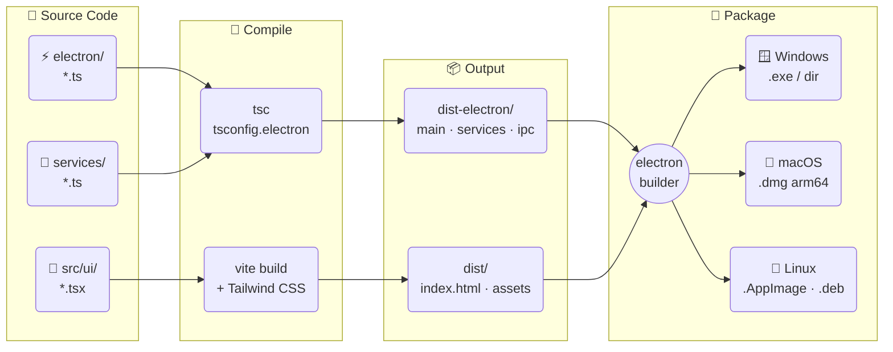
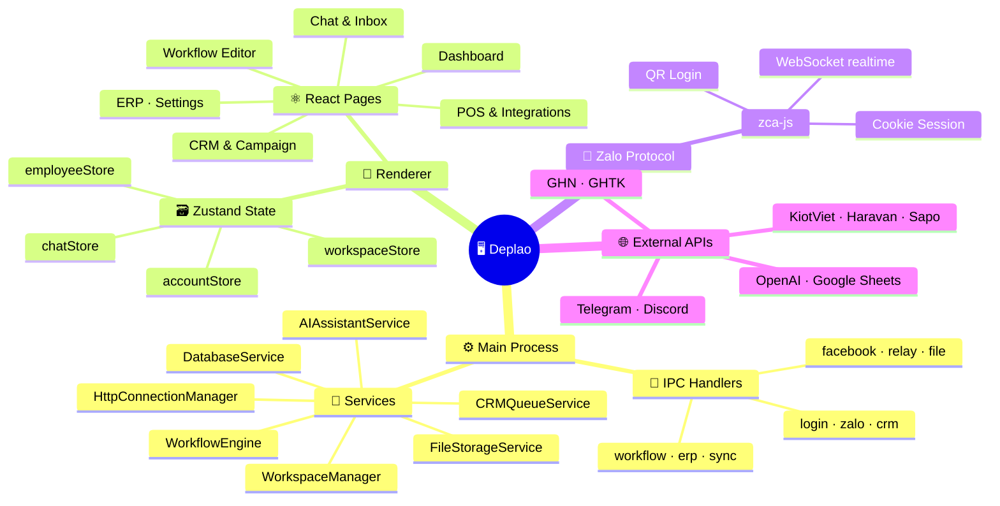
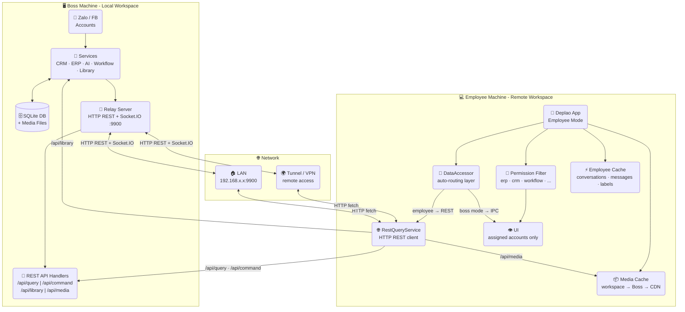
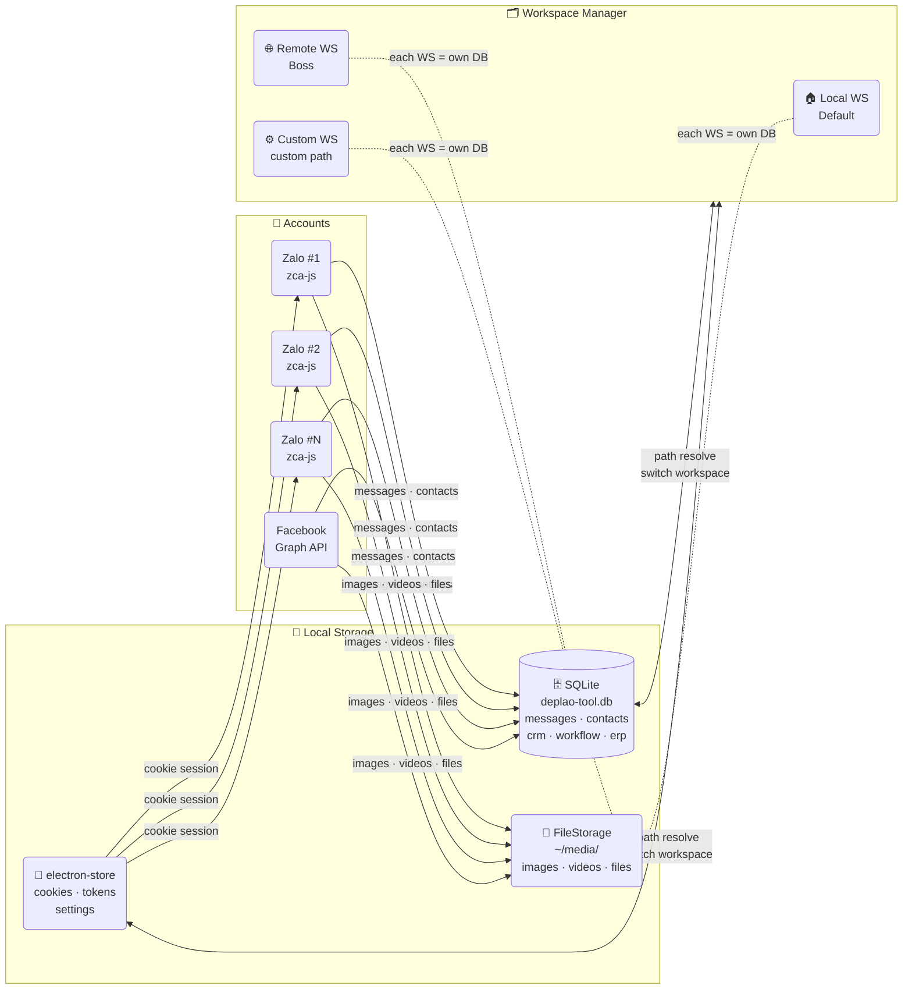

<div align="center">


# Deplao

**Desktop app for managing multiple Zalo, Facebook & Telegram accounts**
CRM · Marketing · ERP · POS · Workflow · AI Assistant — all in one unified workspace

[🌐 Website](https://deplaoapp.com/) · [🇻🇳 Tiếng Việt](./README.md)


</div>

<p align="center">
  <a href="#-download">📥 Download</a> &nbsp;|&nbsp;
  <a href="#-tech-stack">🛠️ Tech Stack</a> &nbsp;|&nbsp;
  <a href="#installation">📦 Install</a> &nbsp;|&nbsp;
  <a href="#public-api-scan-group">🌐 Public API</a> &nbsp;|&nbsp;
  <a href="#-core-feature-groups">✨ Features</a> &nbsp;|&nbsp;
  <a href="#-security-data">🔒 Security</a> &nbsp;|&nbsp;
  <a href="#-license">📝 MIT</a> &nbsp;|&nbsp;
  <a href="#-contact-support">📞 Contact</a>
</p>

---

## ⬇️ Download

<table>
<tr>
<td align="center" width="50%">

<a href="https://github.com/babyvibe/deplao-builder/releases/latest/download/Deplao-Setup-26.9.0.exe">

</a>

<big><strong>Deplao-Setup-26.9.0.exe</strong></big>

</td>
<td align="center" width="50%">

<a href="https://github.com/babyvibe/deplao-builder/releases/latest/download/Deplao-26.9.0-arm64.dmg">

</a>

<big><strong>Deplao-26.9.0-arm64.dmg</strong></big>

</td>
</tr>
<tr>
<td align="center" width="50%">

<a href="https://github.com/babyvibe/deplao-builder/releases/latest/download/Deplao-26.9.0.AppImage">

</a>

<big><strong>Deplao-26.9.0.AppImage</strong></big><br>
<big>works on any distro - <code>chmod +x</code> & run</big>

</td>
<td align="center" width="50%">

<a href="https://github.com/babyvibe/deplao-builder/releases/latest/download/Deplao-26.9.0.dmg">

</a>

<big><strong>Deplao-26.9.0.dmg</strong></big>

</td>
</tr>
</table>

<p align="center">
👉 <strong><a href="https://github.com/babyvibe/deplao-builder/releases">View all releases</a></strong>
</p>

<details>
<summary>⚠️ Security warning on first launch (blocked by Windows / macOS / Linux)</summary>

Deplao is not code-signed (we're bootstrapped), so your OS may show a warning when opening the installer.

---

### 🪟 Windows (.exe)

Windows may show **"Windows protected your PC"**:

👉 How to proceed:
1. Click **More info**
2. Click **Run anyway**

---

### 🍎 macOS (.dmg)

macOS may show **"cannot be opened because it is from an unidentified developer"**

👉 How to proceed:

**Option 1:**
- Right-click the file → **Open**
- Click **Open** again

**Option 2 (if still blocked):**
1. Go to **System Settings → Privacy & Security**
2. Scroll down to Security
3. Click **Open Anyway**

---

### 🐧 Ubuntu Linux (.AppImage)

After downloading the `.AppImage` file:

```bash
chmod +x Deplao-*.AppImage
./Deplao-*.AppImage
```

> If you get "FUSE: fuse2 not available", install `libfuse2`:
> ```bash
> sudo apt install libfuse2
> ```

Or install the `.deb` package:
```bash
sudo dpkg -i Deplao_*_amd64.deb
```

</details>

<p align="center">
  
</p>

## 🛠️ Tech Stack

Deplao is built on the following core technologies:

- **Core libraries:** zca-js & fbchat-v2
- **AI Gateway:** 9router
- **Languages:** TypeScript, JavaScript, SQL, HTML, CSS
- **Desktop:** Electron, React, Vite
- **UI:** Tailwind CSS, PostCSS, React Router
- **Local storage:** SQLite via `better-sqlite3`
- **State & UI specialized:** Zustand, React Flow, Recharts, Quill
- **Backend services:** Node.js + Express
- **Integrations & automation:** Axios, Google APIs / Google Sheets, node-cron, Discord.js, Telegram Bot API, OpenAI API, etc.

---

## 🗺️ Architecture & Flow Diagrams

---

### 1️⃣ Build Pipeline


```mermaid
flowchart LR
    subgraph SRC["📁 Source Code"]
        E("⚡ electron/\n*.ts")
        S("🔧 services/\n*.ts")
        R("🎨 src/ui/\n*.tsx")
    end

    subgraph COMPILE["🔨 Compile"]
        TSC("tsc\ntsconfig.electron")
        VITE("vite build\n+ Tailwind CSS")
    end

    subgraph OUT["📦 Output"]
        DE("dist-electron/\nmain · services · ipc")
        D("dist/\nindex.html · assets")
    end

    subgraph PKG["🚀 Package"]
        EB(("electron\nbuilder"))
        WIN("🪟 Windows\n.exe / dir")
        MAC("🍎 macOS\n.dmg arm64")
        LIN("🐧 Linux\n.AppImage · .deb")
    end

    E & S --> TSC --> DE
    R --> VITE --> D
    DE & D --> EB --> WIN & MAC & LIN
```

---

### 2️⃣ Runtime Architecture


```mermaid
mindmap
  root((🖥️ Deplao))
    ⚙️ Main Process
      📡 IPC Handlers
        login · zalo · crm
        workflow · erp · sync
        facebook · relay · file
      🔧 Services
        DatabaseService
        WorkspaceManager
        WorkflowEngine
        CRMQueueService
        HttpConnectionManager
        FileStorageService
        AIAssistantService
    🎨 Renderer
      ⚛️ React Pages
        Dashboard
        Chat & Inbox
        CRM & Campaign
        Workflow Editor
        POS & Integrations
        ERP · Settings
      🗃️ Zustand State
        accountStore
        chatStore
        workspaceStore
        employeeStore
    📱 Zalo Protocol
      zca-js
        QR Login
        Cookie Session
        WebSocket realtime
    🌐 External APIs
      OpenAI · Google Sheets
      Telegram · Discord
      KiotViet · Haravan · Sapo
      GHN · GHTK
```

---

### 3️⃣ Boss ↔ Employee Model (REST API)


```mermaid
flowchart TB
    subgraph BOSS["🖥️ Boss Machine - Local Workspace"]
        BZ("📱 Zalo / FB\nAccounts")
        BSV("🔧 Services\nCRM · ERP · AI · Workflow · Library")
        BSD[("🗄️ SQLite DB\n+ Media Files")]
        BRL("🔁 Relay Server\nHTTP REST + Socket.IO :9900")
        BRS("📡 REST API Handlers\n/api/query | /api/command\n/api/library | /api/media")
    end

    subgraph NET["🌐 Network"]
        LAN("🏠 LAN\n192.168.x.x:9900")
        WAN("🌍 Tunnel / VPN\nremote access")
    end

    subgraph EMP["💻 Employee Machine - Remote Workspace"]
        EA("📲 Deplao App\nEmployee Mode")
        DA("🔀 DataAccessor\nauto-routing layer")
        RQ("🌐 RestQueryService\nHTTP REST client")
        EP("🔐 Permission Filter\nerp · crm · workflow · ...")
        EU("👁️ UI\nassigned accounts only")
        MC("📦 Media Cache\nworkspace → Boss → CDN")
        EC("⚡ Employee Cache\nconversations · messages · labels")
    end

    BZ --> BSV
    BSV <--> BSD
    BSV --> BRL
    BRL --> BRS
    BRL <-->|HTTP REST + Socket.IO| LAN & WAN
    LAN <-->|HTTP fetch| RQ
    WAN <-->|HTTP fetch| RQ
    RQ -->|/api/query · /api/command| BRS
    RQ -->|/api/media| MC
    RQ -->|/api/library| BSV
    EA --> DA -->|boss mode → IPC| EU
    DA -->|employee → REST| RQ
    EA --> EP --> EU
    EA --> EC
    EA --> MC
```

> **New architecture since v26.9.0:** Employees fetch data via **REST API** (HTTP fetch → Boss) instead of syncing the entire database as before. DataAccessor auto-routes: standalone/boss → direct IPC, employee → RestQueryService → Boss. Socket.IO replaces SSE for more reliable real-time events. Media is cached locally with a workspace → Boss → CDN cascade. Employees still have their own workspace, but no longer need to sync gigabytes of data when launching the app.

---

### 4️⃣ Multi-account & Local Storage


```mermaid
flowchart LR
    subgraph ACCS["👤 Accounts"]
        Z1("Zalo #1\nzca-js")
        Z2("Zalo #2\nzca-js")
        ZN("Zalo #N\nzca-js")
        FB("Facebook\nGraph API")
    end

    subgraph STORE["💾 Local Storage"]
        DB[("🗄️ SQLite\ndeplao-tool.db\nmessages · contacts\ncrm · workflow · erp")]
        MED("📁 FileStorage\n~/media/\nimages · videos · files")
        ES("🔑 electron-store\ncookies · tokens\nsettings")
    end

    subgraph WS["🗂️ Workspace Manager"]
        WA("🏠 Local WS\nDefault")
        WB("🌐 Remote WS\nBoss")
        WC("⚙️ Custom WS\ncustom path")
    end

    Z1 & Z2 & ZN & FB -->|"messages · contacts"| DB
    Z1 & Z2 & ZN & FB -->|"images · videos · files"| MED
    ES -->|"cookie session"| Z1 & Z2 & ZN
    DB & ES <-->|"path resolve\nswitch workspace"| WS
    WA & WB & WC -.-|"each WS = own DB"| DB
```

> Each **Workspace** has its own independent DB + media folder.
> You can move the data directory to another drive without losing any data.

---

## Installation

<details open>
<summary>🛠️ Build from source</summary>

### Requirements

- Windows 10/11, macOS (Apple Silicon), or Ubuntu 20.04+
- Node.js 18+ recommended
- npm 9+

### Install dependencies

```powershell
npm install --legacy-peer-deps
```

### Run in development mode

```powershell
npm run dev
```

### Build production app

```powershell
npm run production
```

### Local data

- App data uses local SQLite
- Storage directory can be changed in `Settings`

</details>

<a id="public-api-scan-group"></a>

## 🌐 Public API - Scan Zalo Group Members

Deplao provides an API that scans the member list of a Zalo group. This API is **free to use** and does not check a subscription expiry date, but every request must use a valid Zalo session belonging to you. Only scan data your account is allowed to access, and comply with Zalo's terms and applicable personal-data rules.

### Endpoint

```http
POST https://deplaoapp.com/api/scan/group
Content-Type: application/json
x-api-key: fb7457b7a39bdc9e742f08b657a8059a5e6a8fda6e32bfe0bfecf37eadf519eb
```

`x-api-key` is a public key, also present in `src/ui/lib/backendService.ts`, so Deplao clients and external integrations use the same contract. Deplao uses its own API plus an AES envelope to make trivial direct calls or forged payloads harder; it is not a replacement for protecting your cookie. Cookie and IMEI are still sensitive session data: never commit them to Git, place them in public logs, or expose them to an untrusted frontend.

### Parameters

The request is an envelope with `page_id` and `body`. `body` is a Base64 string encrypted with AES-128-CBC (an IV of sixteen `0x00` bytes), using the first 16 bytes of the hex API key as the encryption key. The decrypted payload contains:

| Field | Type | Required | Description |
| --- | --- | :---: | --- |
| `page_id` | `string` | Yes | ID of the Zalo account/page that performs the scan. It is present in both the outer envelope and encrypted payload. |
| `cookie` | `string` | Yes | A valid Zalo session cookie for the account that performs the scan. |
| `imei` | `string` | Yes | Device/IMEI ID paired with that Zalo session. |
| `groupId` | `string` | Yes | Numeric Zalo group ID. Resolve invitation or group links to a Group ID before calling the API. |

### Node.js example

```js
import crypto from 'node:crypto';

const endpoint = 'https://deplaoapp.com/api/scan/group';
const apiKey = 'fb7457b7a39bdc9e742f08b657a8059a5e6a8fda6e32bfe0bfecf37eadf519eb';

function encryptBody(payload) {
  const key = Buffer.from(apiKey, 'hex').subarray(0, 16);
  const iv = Buffer.alloc(16, 0);
  const cipher = crypto.createCipheriv('aes-128-cbc', key, iv);
  return Buffer.concat([
    cipher.update(JSON.stringify(payload), 'utf8'),
    cipher.final(),
  ]).toString('base64');
}

const pageId = process.env.ZALO_PAGE_ID;
const body = {
  page_id: pageId,
  cookie: process.env.ZALO_COOKIE,
  imei: process.env.ZALO_IMEI,
  groupId: '1234567890123456789',
};

const response = await fetch(endpoint, {
  method: 'POST',
  headers: {
    'content-type': 'application/json',
    'x-api-key': apiKey,
  },
  body: JSON.stringify({ page_id: pageId, body: encryptBody(body) }),
});

const result = await response.json();
if (!result.success) throw new Error(result.error || 'Group scan failed');
console.log(`Received ${result.totalMembers} members`);
```

### Successful response

```json
{
  "success": true,
  "groupId": "1234567890123456789",
  "totalMembers": 2,
  "members": [
    {
      "userId": "987654321",
      "id": "987654321",
      "globalId": "987654321_0",
      "displayName": "Nguyen An",
      "zaloName": "Nguyen An",
      "avatar": "https://zalo-ava.example/avatar.jpg",
      "accountStatus": 1,
      "type": 0,
      "lastUpdateTime": 1726824000000
    }
  ]
}
```

| Response field | Description |
| --- | --- |
| `success` | `true` when the backend completed the scan. |
| `groupId` | The scanned Group ID. |
| `totalMembers` | Total members returned by this scan. |
| `members` | Member list. `userId`/`id` identify the user; `globalId` is Zalo's complete identifier. Names, avatar and status may be empty depending on Zalo data access. |
| `accountStatus`, `type`, `lastUpdateTime` | Metadata returned by Zalo. Preserve it if your calling application needs to interpret it. |

### Error response

```json
{
  "success": false,
  "groupId": "1234567890123456789",
  "totalMembers": 0,
  "members": [],
  "error": "The Zalo cookie has expired or the account cannot access this group"
}
```

Common causes are an invalid API key, missing parameters, cookie/IMEI no longer matching the Zalo session, an invalid Group ID, no permission to view the group, or a temporary Zalo limit. Check `success` before using `members`; do not retry aggressively when the upstream rejects a request.

### Privacy, terms and responsibility

- The scan feature in Deplao and this Public API are currently **free** and have no expiry check.
- Your cookie is sent only in the encrypted request needed for the scan; **Deplao does not store that cookie on its server** after the request is processed.
- By using the feature in Deplao or calling this Public API, you confirm that you have read and accepted Deplao's policies and terms of use. You remain responsible for the account, group and data you scan.
- Results depend on the Zalo session, group permissions and Zalo's response. Deplao is not responsible for account restrictions, incorrect data, platform changes, or any issues arising from use of this feature or API.
- Consider the use carefully, scan only necessary data, and do not use the result for spam, privacy violations, or any breach of Zalo's terms.

## 🚀 What is Deplao?

At a glance, Deplao is:

- **Operations hub** - multi-account, unified inbox, fast reply
- **Customer management layer** - CRM, labels, interaction history, campaigns
- **Automation layer** - workflow, AI, background triggers and actions
- **Business integration layer** - POS, shipping, APIs and external tools
- **Internal management layer** - reports, ERP, permissions, employee workspaces

## ✨ Highlights

- 👤 **Multi-account Zalo, Facebook, Telegram Bot, Telegram User** - unlimited accounts, quick switching
- 💬 **Unified inbox** - merged mode combines conversations from all accounts in one view
- 👥 **CRM & Campaigns** - manage contacts, labels, internal notes, re-engage existing customers; scan hidden group members and non-joined groups to find new leads
- ⚙️ **Workflow automation** - drag-and-drop Trigger → Node → Action, or use AI to build flows - runs 24/7 without code
- 🤖 **AI Assistant** - reply suggestions, in-chat AI, auto-classify and respond to customers around the clock
- 🔗 **External integrations** - POS, shipping, payments, Google Sheets, Telegram, Discord, Email, HTTP Request - usable in chat and workflow
- 📈 **Reports & analytics** - track messages, contacts, labels, employees, campaigns, workflows, AI usage
- 🗂️ **Internal ERP** - tasks, calendar, notes and team operations in the same system
- 🧑‍💼 **Boss ↔ Employee workspace** - connect over **LAN or WAN**, granular permissions, per-employee performance tracking
- 🔒 **Per-account proxy** - assign an independent HTTP/HTTPS/SOCKS5 proxy to each Zalo account before login
- 🔐 **Local-first data** - all data stays on the user's machine

### Screenshots

Screens are ordered by typical usage flow: dashboard → chat → CRM → workflow → POS / reports / ERP.

<table>
  <tr>
    <td>
      
      <br />
      <sub><strong>Multi-account dashboard</strong></sub>
    </td>
    <td>
      
      <br />
      <sub><strong>Unified inbox with AI</strong></sub>
    </td>
    <td>
      
      <br />
      <sub><strong>CRM & contacts</strong></sub>
    </td>
  </tr>
  <tr>
    <td>
      
      <br />
      <sub><strong>Group member scanning</strong></sub>
    </td>
    <td>
      
      <br />
      <sub><strong>Mass messaging campaigns</strong></sub>
    </td>
    <td>
      
      <br />
      <sub><strong>Workflow editor</strong></sub>
    </td>
  </tr>
  <tr>
    <td>
      
      <br />
      <sub><strong>Workflow node detail</strong></sub>
    </td>
    <td>
      
      <br />
      <sub><strong>AI workflow generation</strong></sub>
    </td>
    <td>
      
      <br />
      <sub><strong>POS, shipping & payments</strong></sub>
    </td>
  </tr>
  <tr>
    <td>
      
      <br />
      <sub><strong>Reports & analytics</strong></sub>
    </td>
    <td>
      
      <br />
      <sub><strong>Employee reports</strong></sub>
    </td>
    <td>
      
      <br />
      <sub><strong>Internal ERP</strong></sub>
    </td>
  </tr>
</table>

## 🎯 Who is it for?

Deplao is designed for:

- Online shops and sales teams closing deals via Zalo, Facebook, Telegram
- Automating workflows, combining marketing to find new customers, and automating customer care
- SMEs that need multiple staff handling the inbox simultaneously
- Marketing agencies or freelancers managing multiple client accounts
- Spas, clinics, education, F&B and any business that needs recurring customer care
- Teams wanting to combine chat, CRM, workflow, AI and ERP in one desktop app

## 🧩 Core feature groups

### 1) Multi-account & unified inbox
- Log in to multiple Zalo, Facebook, Telegram bot, Telegram user accounts
- Visual account management dashboard
- Merge multiple accounts into a single unified inbox
- Search by name, nickname, phone number
- Quick filters: unread, unanswered, labels, conversation status
- Assign proxy to each Zalo account

### 2) Full-featured chat
- Send text, images, video, files
- Emoji, stickers, reply, mention members
- Polls, group notes, reminders, contact cards
- Quick messages to save templates and trigger by keyword
- Unlimited message pinning, media and attachment management

### 3) CRM & customer care
- Sync friends, group members and contact profiles
- Store phone, gender, birthday, internal notes
- Create and manage Zalo labels bi-directionally
- Filter contacts by multiple criteria for targeted outreach
- Create campaigns: mass message, add friend, invite to group - with real-time progress

### 4) Workflow automation
- No-code drag-and-drop workflow builder
- AI assistant generates nodes and workflows from plain-text commands (see section 7)
- Triggers: message received, label applied, reaction, cron schedule, group events…
- Actions: send message/image/file, find user, manage group, mute, forward, recall…
- Integrations: logic, Google Sheets, AI, Telegram, Discord, Email, Notion, HTTP Request
- Execution history for easy inspection and debugging

### 5) Sales integrations
- POS: KiotViet, Haravan, Sapo, Nhanh.vn, Pancake POS
- Shipping: GHN, GHTK
- Payments: Sepay, Casso
- AI Assistant with reply suggestions and in-chat Q&A (see section 7)
- Easy to combine into end-to-end sales and customer care pipelines

### 6) Reports, ERP & employee management
- Reports: messages, contacts, campaigns, workflows, AI, employees
- Internal ERP: Tasks, Calendar, Notes
- Boss ↔ employee model with relay server and module-level permissions
- Track work performance per person and per time period

### 7) 🤖 AI Assistant
- Smart reply suggestions in conversations
- Real-time Q&A with AI directly in the chat window
- Create workflows using plain natural language commands - no drag-and-drop needed
- Use AI action nodes in workflows to build 24/7 auto-reply chatbots
- Multi-platform AI support: OpenAI, Claude, Gemini, Deepseek, Grok, and local AI gateways like 9Router, OpenRouter, etc.

## 🔒 Security & data

Deplao prioritizes a local-first architecture:

- All messages, contacts, CRM data, settings and media are stored on the user's machine
- Login via QR Code - no Zalo password stored; cookies are encrypted on-device
- Users can change the storage directory to another drive when needed
- Ideal for teams that require strict internal data control

## 💻 Runtime requirements

- Stable 24/7 internet connection for conversation sync and automation
- Keep the app running continuously when using workflows or managing a team

---

## 📣 Contact & support

- Bug reports, feature requests, questions: 👉 [Open an issue](https://github.com/babyvibe/deplao-builder/issues)

## 🙏 Acknowledgements

Deplao would like to thank the projects: zca-js & fbchat-v2.

---

## 📝 License

This project is distributed under the **MIT License**.
See the [LICENSE](LICENSE) file for details.

---

## 📝 License

This project is distributed under the **MIT License**.
See the [LICENSE](LICENSE) file for details.

---
