# Deplao
*Website giới thiệu*:  https://deplaoapp.com/

<p>
  <strong>🌐 Language:</strong>
  &nbsp;🇻🇳 <strong>Tiếng Việt</strong>
  &nbsp;|&nbsp;
  🇬🇧 <a href="./README.en.md">English</a>
</p>


---

> Phần mềm desktop quản lý Zalo & Facebook cá nhân Đa tài khoản tích hợp CRM, ERP, POS, Workflow và AI Assistant giúp đội nhóm bán hàng, chăm sóc khách hàng và marketing trên Zalo và Facebook vận hành tập trung trong một ứng dụng duy nhất.

[](#)
[](#-runtime-requirements)
[](#)
[](#)
[](#)
[](#)
[](#)
[](#)
[](#giấy-phép)
[](https://github.com/babyvibe/deplao-builder/issues)


<p align="center">
  <a href="#-tải-xuống">📥 Tải xuống</a> &nbsp;|&nbsp;
  <a href="#-công-nghệ-ngôn-ngữ-sử-dụng">🛠️ Công nghệ</a> &nbsp;|&nbsp;
  <a href="#cài-đặt">📦 Cài đặt</a> &nbsp;|&nbsp;
  <a href="#-các-nhóm-tính-năng-chính">✨ Tính năng</a> &nbsp;|&nbsp;
  <a href="#-bảo-mật-dữ-liệu">🔒 Bảo mật</a> &nbsp;|&nbsp;
  <a href="#-giấy-phép">📝 MIT</a> &nbsp;|&nbsp;
  <a href="#-liên-hệ">📞 Liên hệ</a>
</p>

---

## ⬇️ Tải xuống

<table>
<tr>
<td align="center" width="50%">

<a href="https://github.com/babyvibe/deplao-builder/releases/latest/download/Deplao-Setup-26.7.4.exe">

</a>

<big><strong>Deplao-Setup-26.7.4.exe</strong></big>

</td>
<td align="center" width="50%">

<a href="https://github.com/babyvibe/deplao-builder/releases/latest/download/Deplao-26.7.4-arm64.dmg">

</a>

<big><strong>Deplao-26.7.4-arm64.dmg</strong></big>

</td>
</tr>
<tr>
<td align="center" width="50%">

<a href="https://github.com/babyvibe/deplao-builder/releases/latest/download/Deplao-26.7.4.AppImage">

</a>

<big><strong>Deplao-26.7.4.AppImage</strong></big><br>
<big>chạy mọi distro - <code>chmod +x</code> là dùng được</big>

</td>
<td align="center" width="50%">

<a href="https://github.com/babyvibe/deplao-builder/releases/latest/download/Deplao-26.7.4.dmg">

</a>

<big><strong>Deplao-26.7.4.dmg</strong></big>

</td>
</tr>
</table>

<p align="center">
👉 <strong><a href="https://github.com/babyvibe/deplao-builder/releases">Xem tất cả phiên bản</a></strong>
</p>

<details>
<summary>⚠️ Lưu ý khi mở file cài đặt (bị chặn bởi Windows / macOS / Linux)</summary>

Do Deplao chưa được ký chứng chỉ (code signing) - nói thẳng ra là nghèo, nên hệ điều hành có thể hiển thị cảnh báo khi mở file. Bạn có thể làm theo hướng dẫn dưới đây:

---

### 🪟 Windows (.exe)

Khi mở file `.exe`, Windows có thể hiển thị cảnh báo **"Windows protected your PC"**:

👉 Cách xử lý:
1. Nhấn **More info**
2. Chọn **Run anyway**

---

### 🍎 macOS (.dmg)

Khi mở file `.dmg`, macOS có thể báo **"cannot be opened because it is from an unidentified developer"**

👉 Cách xử lý:

**Cách 1:**
- Chuột phải vào file → chọn **Open**
- Nhấn **Open** lần nữa

**Cách 2 (nếu vẫn bị chặn):**
1. Vào **System Settings → Privacy & Security**
2. Kéo xuống phần Security
3. Nhấn **Open Anyway**

---

### 🐧 Ubuntu Linux (.AppImage)

Sau khi tải file `.AppImage`:

```bash
chmod +x Deplao-*.AppImage
./Deplao-*.AppImage
```

> Nếu gặp lỗi "FUSE: fuse2 not available", cài `libfuse2`:
> ```bash
> sudo apt install libfuse2
> ```

Hoặc cài bản `.deb`:
```bash
sudo dpkg -i Deplao_*_amd64.deb
```

</details>

<p align="center">
  
</p>

## 🛠️ Công nghệ & ngôn ngữ sử dụng

Deplao hiện được xây dựng trên các công nghệ chính sau:

- **Thư viện chính:** zca-js & fbchat-v2
- **AI Gateway:** 9router
- **Ngôn ngữ:** TypeScript, JavaScript, SQL, HTML, CSS
- **Ứng dụng desktop:** Electron, React, Vite
- **Giao diện:** Tailwind CSS, PostCSS, React Router
- **Lưu trữ dữ liệu cục bộ:** SQLite qua `better-sqlite3`
- **State & UI chuyên biệt:** Zustand, React Flow, Recharts, Quill
- **Backend dịch vụ:** Node.js + Express
- **Tích hợp & automation:** Axios, Google APIs / Google Sheets, node-cron, Discord.js, Telegram Bot API, OpenAI API, v.v.

---


## Cài đặt

<details open>
<summary>🛠️ Tự build từ source</summary>

### Yêu cầu

- Windows 10/11, macOS (Apple Silicon), hoặc Ubuntu 20.04+
- Node.js 18+ khuyến nghị
- npm 9+

### Cài đặt

```powershell
npm install --legacy-peer-deps
```

### Chạy development

```powershell
npm run dev
```

### Build app

```powershell
npm run production
```

### Dữ liệu cục bộ

- Dữ liệu app dùng SQLite cục bộ
- Có thể đổi thư mục lưu trữ trong phần `Cài đặt`

</details>

## 🗺️ Sơ đồ kiến trúc & luồng hoạt động

---

### 1️⃣ Luồng Build

```mermaid
flowchart LR
    subgraph SRC["📁 Source Code"]
        E("âš¡ electron/\n*.ts")
        S("🔧 services/\n*.ts")
        R("🎨 src/ui/\n*.tsx")
    end

    subgraph COMPILE["🔨 Compile"]
        TSC("tsc\ntsconfig.electron")
        VITE("vite build\n+ Tailwind CSS")
    end

    subgraph OUT["📦 Output"]
        DE("dist-electron/\nmain · services · ipc")
        D("dist/\nindex.html · assets")
    end

    subgraph PKG["🚀 Đóng gói"]
        EB(("electron\nbuilder"))
        WIN("🪟 Windows\n.exe / dir")
        MAC("🍎 macOS\n.dmg arm64")
        LIN("🐧 Linux\n.AppImage · .deb")
    end

    E & S --> TSC --> DE
    R --> VITE --> D
    DE & D --> EB --> WIN & MAC & LIN
```



---

### 2️⃣ Kiến trúc Runtime

```mermaid
mindmap
  root((🖥️ Deplao))
    ⚙️ Main Process
      📡 IPC Handlers
        login · zalo · crm
        workflow · erp · sync
        facebook · relay · file
      🔧 Services
        DatabaseService
        WorkspaceManager
        WorkflowEngine
        CRMQueueService
        HttpConnectionManager
        FileStorageService
        AIAssistantService
    🎨 Renderer
      ⚛️ React Pages
        Dashboard
        Chat & Inbox
        CRM & Campaign
        Workflow Editor
        POS & Tích hợp
        ERP · Settings
      🗃️ Zustand State
        accountStore
        chatStore
        workspaceStore
        employeeStore
    📱 Giao thức Zalo
      zca-js
        QR Login
        Cookie Session
        WebSocket realtime
    🌐 External APIs
      OpenAI · Google Sheets
      Telegram · Discord
      KiotViet · Haravan · Sapo
      GHN · GHTK
```



---

### 3️⃣ Mô hình Boss ↔ Nhân viên (REST API)

```mermaid
flowchart TB
    subgraph BOSS["🖥️ Máy BOSS - Local Workspace"]
        BZ("📱 Zalo / FB\nAccounts")
        BSV("🔧 Services\nCRM · ERP · AI · Workflow · Library")
        BSD[("🗄️ SQLite DB\n+ Media Files")]
        BRL("🔁 Relay Server\nHTTP REST + Socket.IO :9900")
        BRS("📡 REST API Handlers\n/api/query | /api/command\n/api/library | /api/media")
    end

    subgraph NET["🌐 Kết nối"]
        LAN("🏠 LAN\n192.168.x.x:9900")
        WAN("🌍 Tunnel / VPN\ntruy cập từ xa")
    end

    subgraph EMP["💻 Nhân Viên - Remote Workspace"]
        EA("📲 Deplao App\nEmployee Mode")
        DA("🔀 DataAccessor\ntự động routing")
        RQ("🌐 RestQueryService\nHTTP REST client")
        EP("🔐 Permission Filter\nerp · crm · workflow · ...")
        EU("👁️ UI\nchỉ thấy TK được gán")
        MC("📦 Media Cache\nworkspace → Boss → CDN")
        EC("⚡ Employee Cache\nconversations · messages · labels")
    end

    BZ --> BSV
    BSV <--> BSD
    BSV --> BRL
    BRL --> BRS
    BRL <-->|HTTP REST + Socket.IO| LAN & WAN
    LAN <-->|HTTP fetch| RQ
    WAN <-->|HTTP fetch| RQ
    RQ -->|/api/query · /api/command| BRS
    RQ -->|/api/media| MC
    RQ -->|/api/library| BSV
    EA --> DA -->|boss mode → IPC| EU
    DA -->|employee → REST| RQ
    EA --> EP --> EU
    EA --> EC
    EA --> MC
```



> **Kiến trúc mới từ v26.7.4:** Employee gọi dữ liệu qua **REST API** (HTTP fetch → Boss) thay vì sync toàn bộ DB như trước. DataAccessor tự động routing: standalone/boss → IPC trực tiếp, employee → RestQueryService → Boss. Socket.IO thay SSE cho realtime event ổn định hơn. Media được cache local với cascade workspace → Boss → CDN. Employee vẫn có workspace riêng, nhưng không cần sync hàng GB khi vào app.

---

### 4️⃣ Đa tài khoản & Lưu trữ

```mermaid
flowchart LR
    subgraph ACCS["👤 Tài khoản"]
        Z1("Zalo #1\nzca-js")
        Z2("Zalo #2\nzca-js")
        ZN("Zalo #N\nzca-js")
        FB("Facebook\nGraph API")
    end

    subgraph STORE["💾 Lưu trữ cục bộ"]
        DB[("🗄️ SQLite\ndeplao-tool.db\nmessages · contacts\ncrm · workflow · erp")]
        MED("📁 FileStorage\n~/media/\nảnh · video · file")
        ES("🔑 electron-store\ncookies · tokens\nsettings")
    end

    subgraph WS["🗂️ Workspace Manager"]
        WA("🏠 Local WS\nDefault")
        WB("🌐 Remote WS\nBoss")
        WC("⚙️ Custom WS\npath tuỳ chỉnh")
    end

    Z1 & Z2 & ZN & FB -->|"tin nhắn · danh bạ"| DB
    Z1 & Z2 & ZN & FB -->|"ảnh · video · file"| MED
    ES -->|"cookie session"| Z1 & Z2 & ZN
    DB & ES <-->|"path resolve\nswitch workspace"| WS
    WA & WB & WC -.-|"mỗi WS = DB riêng"| DB
```



> Mỗi **Workspace** có DB + media folder độc lập - đổi hoặc di chuyển sang ổ đĩa khác không mất dữ liệu.

---


## 🚀 Deplao là gì?


Nếu nhìn nhanh, có thể hiểu Deplao là:

- **trung tâm vận hành Zalo**: nhiều tài khoản, inbox tập trung, trả lời nhanh
- **lớp quản lý khách hàng**: CRM, nhãn, lịch sử tương tác, campaign
- **lớp tự động hóa**: workflow, AI, trigger và action chạy nền
- **lớp kết nối kinh doanh**: POS, vận chuyển, API và công cụ ngoài
- **lớp quản trị nội bộ**: báo cáo, ERP, phân quyền, workspace nhân viên


## ✨ Điểm nổi bật

- 👤 **Đa tài khoản Zalo** - đăng nhập không giới hạn tài khoản, chuyển đổi qua lại nhanh
- 💬 **Hộp thư tập trung** - chế độ gộp tài khoản giúp gom và xử lý hội thoại từ nhiều tài khoản trong một giao diện duy nhất
- 👥 **CRM & Campaign** - quản lý liên hệ, nhãn, ghi chú nội bộ, chăm sóc khách cũ. Quét thành viên nhóm ẩn, nhóm chưa tham gia để tìm khách mới.
- ⚙️ **Workflow tự động hóa** - kéo-thả Trigger → Node → Action hoặc dùng AI tạo quy trình, chạy nền 24/7 không cần code
- 🤖 **AI Assistant** - hỗ trợ gợi ý câu trả lời, chat trực tiếp trong hội thoại. Còn giúp phân loại tin nhắn, trả lời khách hàng 24/7.
- 🔗 **Tích hợp ngoài** - POS, vận chuyển, thanh toán, Google Sheets, Telegram, Discord, Email, HTTP Request... Kết hợp sử dụng khi chat hoặc workflow
- 📈 **Báo cáo & phân tích** - theo dõi tin nhắn, liên hệ, nhãn, nhân viên, chiến dịch, workflow, AI.
- 🗂️ **ERP nội bộ** - task, lịch làm việc, notes và phối hợp vận hành nội bộ ngay trong cùng hệ thống
- 🧑‍💼 **Workspace boss ↔ nhân viên** - kết nối qua **LAN hoặc WAN** (Cloudflare Tunnel), phân quyền chi tiết và theo dõi hiệu suất từng nhân viên
- 🔒 **Proxy per-account** - gán Proxy riêng cho từng tài khoản Zalo trước khi đăng nhập
- 🔐 **Dữ liệu lưu cục bộ** - ưu tiên quyền kiểm soát dữ liệu và bảo mật trên máy người dùng


### Xem nhanh giao diện Deplao

Các màn hình dưới đây được sắp theo luồng sử dụng thực tế: từ dashboard → chat → CRM → workflow → POS / báo cáo / ERP.

<table>
  <tr>
    <td>
      
      <br />
      <sub><strong>Dashboard đa tài khoản</strong></sub>
    </td>
    <td>
      
      <br />
      <sub><strong>Chat tập trung tích hợp AI gợi ý trả lời</strong></sub>
    </td>
    <td>
      
      <br />
      <sub><strong>CRM & liên hệ</strong></sub>
    </td>
  </tr>
  <tr>
    <td>
      
      <br />
      <sub><strong>Quét thành viên nhóm</strong></sub>
    </td>
    <td>
      
      <br />
      <sub><strong>Chiến dịch gửi tin hàng loạt</strong></sub>
    </td>
    <td>
      
      <br />
      <sub><strong>Workflow editor</strong></sub>
    </td>
  </tr>
  <tr>
    <td>
      
      <br />
      <sub><strong>Chi tiết workflow</strong></sub>
    </td>
    <td>
      
      <br />
      <sub><strong>Ra lệnh tạo Workflow bằng AI</strong></sub>
    </td>
    <td>
      
      <br />
      <sub><strong>Tích hợp POS, VC, Thanh toán</strong></sub>
    </td>
  </tr>
  <tr>
    <td>
      
      <br />
      <sub><strong>Báo cáo & phân tích</strong></sub>
    </td>
    <td>
      
      <br />
      <sub><strong>Báo cáo nhân viên</strong></sub>
    </td>
    <td>
      
      <br />
      <sub><strong>ERP ná»™i bá»™</strong></sub>
    </td>
  </tr>
</table>

## 🎯 Phù hợp với ai?

Deplao phù hợp cho:

- shop online và đội ngũ chốt đơn qua Zalo
- doanh nghiệp SME cần nhiều nhân viên xử lý inbox cùng lúc
- marketing agency hoặc freelancer quản lý nhiều tài khoản khách hàng
- spa, phòng khám, giáo dục, F&B và các mô hình cần chăm sóc khách hàng định kỳ
- đội nhóm muốn kết hợp chat, CRM, workflow, AI và ERP trong một desktop app duy nhất

## 🧩 Các nhóm tính năng chính

### 1) Quản lý đa tài khoản & inbox tập trung
- đăng nhập nhiều tài khoản Zalo bằng QR Code, Facebook bằng tài khoản hoặc cookie
- dashboard quản lý tài khoản trực quan
- gộp nhiều tài khoản vào một inbox hợp nhất
- tìm kiếm theo tên, biệt danh, số điện thoại
- lọc nhanh theo chưa đọc, chưa trả lời, nhãn và trạng thái hội thoại
- **proxy per-account**: gán Proxy riêng cho từng tài khoản Zalo

### 2) Chat đầy đủ tính năng
- gửi tin nhắn văn bản, ảnh, video, file
- emoji, sticker, reply, tag thành viên
- poll, ghi chú nhóm, nhắc nhở, gửi danh thiếp
- quick messages để lưu mẫu tin và gọi nhanh bằng từ khóa
- ghim tin nhắn không giới hạn, quản lý media và file đính kèm

### 3) CRM & chăm sóc khách hàng
- đồng bộ bạn bè, thành viên nhóm và hồ sơ liên hệ
- lưu số điện thoại, giới tính, ngày sinh, ghi chú nội bộ
- tạo và quản lý nhãn Zalo hai chiều
- lọc liên hệ theo nhiều tiêu chí để chăm sóc đúng nhóm khách hàng
- tạo campaign gửi tin, kết bạn, mời vào nhóm với tiến độ realtime

### 4) Workflow tự động hóa
- workflow kéo-thả không cần code
- tích hợp trợ lý AI tạo node và workflow bằng câu lệnh (xem mục 7)
- hỗ trợ trigger từ tin nhắn, nhãn, react, lịch cron, sự kiện nhóm...
- action gửi tin, gửi ảnh/file, tìm user, quản lý nhóm, mute, forward, recall...
- tích hợp logic, Google Sheets, AI, Telegram, Discord, Email, Notion và HTTP Request
- có lịch sử chạy để kiểm tra và debug dễ dàng

### 5) Tích hợp phục vụ bán hàng
- POS: KiotViet, Haravan, Sapo, Nhanh.vn, Pancake POS
- vận chuyển: GHN, GHTK
- AI Assistant gợi ý trả lời, hỏi đáp trực tiếp trong hội thoại (xem mục 7)
- dễ kết hợp thành quy trình bán hàng và chăm sóc khách hàng khép kín

### 6) Báo cáo, ERP và nhân viên
- báo cáo tin nhắn, liên hệ, chiến dịch, workflow, AI, nhân viên
- ERP nội bộ gồm Task, Calendar, Notes
- mô hình boss ↔ nhân viên và phân quyền module
- hỗ trợ theo dõi hiệu suất làm việc theo từng người và từng giai đoạn

### 7) 🤖 Trợ lý AI (AI Assistant)
- gợi ý trả lời thông minh trong hội thoại Zalo và Facebook
- hỏi đáp trực tiếp với AI ngay trong khung chat
- tạo workflow tự động bằng câu lệnh tiếng Việt mà không cần kéo-thả
- dùng node AI trong workflow để xây dựng chatbot trả lời tự động 24/7
- hỗ trợ đa nền tảng AI: OpenAI, Claude, Gemini và 9router (AI gateway local)

## 🔒 Bảo mật & dữ liệu

Deplao ưu tiên kiến trúc chạy cục bộ trên máy người dùng:

- tất cả dữ liệu tin nhắn, danh bạ, CRM, cài đặt và media được lưu trên máy
- đăng nhập bằng QR Code, không yêu cầu lưu mật khẩu Zalo, Cookie được mã hóa lưu trên máy
- người dùng có thể đổi thư mục lưu trữ dữ liệu sang ổ đĩa khác khi cần
- phù hợp với đội nhóm muốn kiểm soát dữ liệu nội bộ chặt chẽ hơn

## 💻 Yêu cầu vận hành

- kết nối Internet 24/7 ổn định để đồng bộ hội thoại và automation
- nên để app hoạt động liên tục nếu dùng workflow hoặc vận hành đội nhóm


---------------------------------------------------------------------------------------------------------------------------------------------

## 📣 Liên hệ

- Báo lỗi, góp ý hoặc cần hỗ trợ: 👉 [Tạo issue tại đây](https://github.com/babyvibe/deplao-builder/issues)

## 🙏 Lời cảm ơn

Deplao xin gửi lời cảm ơn đến dự án:
👉 https://github.com/RFS-ADRENO/zca-js
👉 https://github.com/m008v/fbchat-v2
Nhờ những đóng góp và nền tảng từ dự án này 💙

---

## 📝 Giấy phép

Dự án được phân phối dưới giấy phép **MIT**.
Xem file [LICENSE](LICENSE) để biết thêm chi tiết.

---

