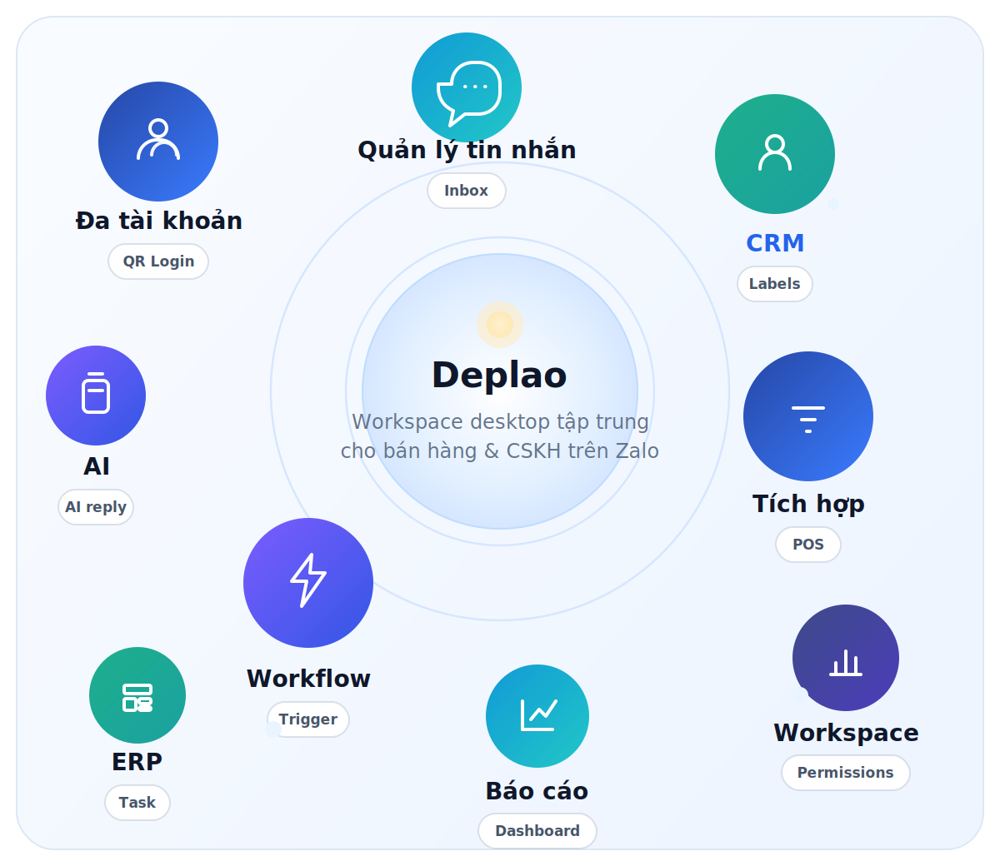
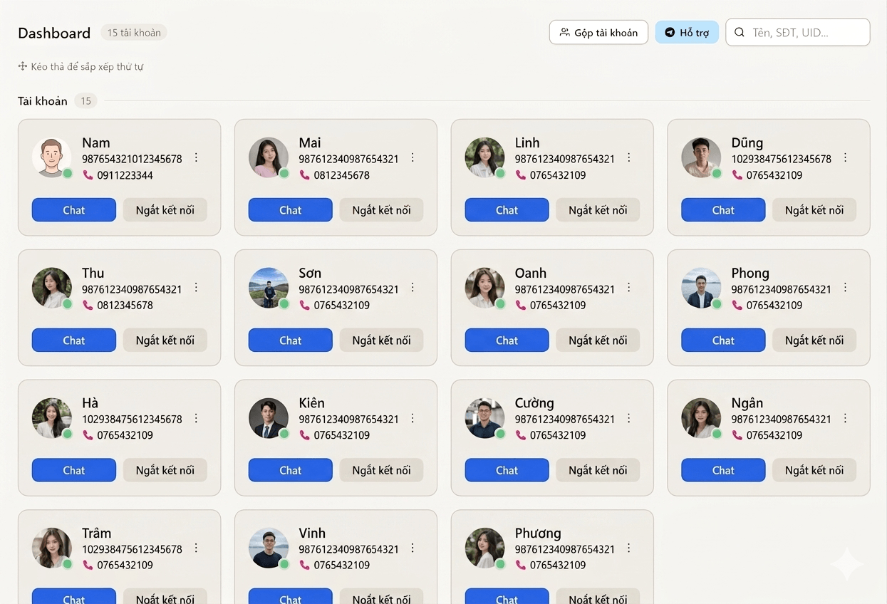
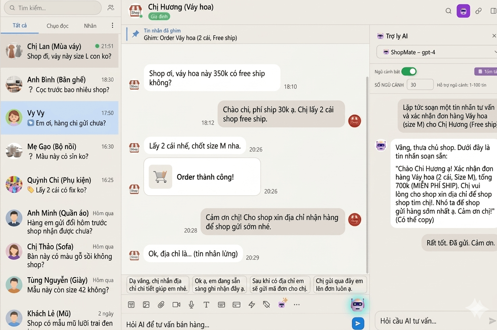
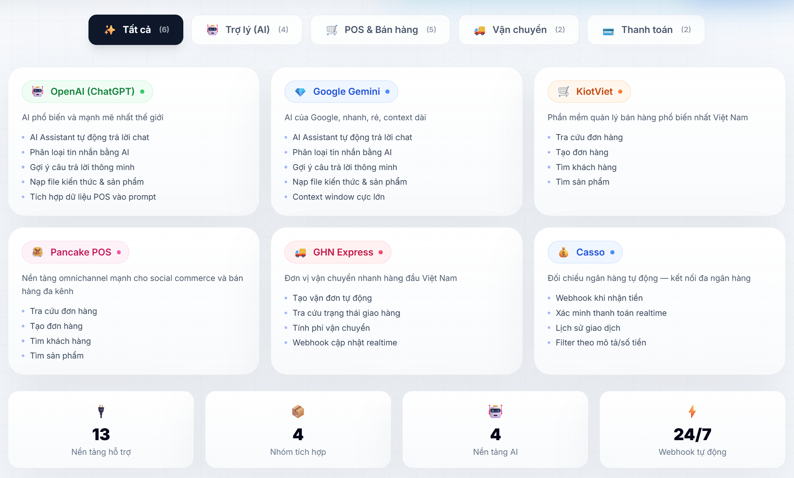
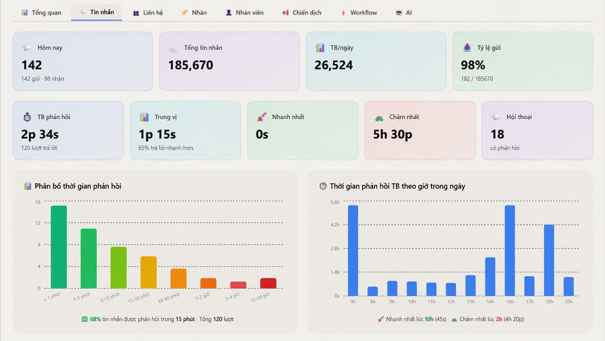

# Deplao

> Phần mềm desktop quản lý Zalo chuyên nghiệp Đa tài khoản tích hợp CRM, Workflow và AI Assistant giúp đội nhóm bán hàng và chăm sóc khách hàng trên Zalo vận hành tập trung trong một ứng dụng duy nhất.

Website: http://deplaoapp.com/

## 🚀 Deplao là gì?

  

Nếu nhìn nhanh, có thể hiểu Deplao là:

- **trung tâm vận hành Zalo**: nhiều tài khoản, inbox tập trung, trả lời nhanh
- **lớp quản lý khách hàng**: CRM, nhãn, lịch sử tương tác, campaign
- **lớp tự động hóa**: workflow, AI, trigger và action chạy nền
- **lớp kết nối kinh doanh**: POS, vận chuyển, API và công cụ ngoài
- **lớp quản trị nội bộ**: báo cáo, ERP, phân quyền, workspace nhân viên

## ✨ Điểm nổi bật

- 👤 **Đa tài khoản Zalo** — đăng nhập không giới hạn tài khoản, chuyển đổi qua lại nhanh
- 💬 **Hộp thư tập trung** — chế độ gộp tài khoản giúp gom và xử lý hội thoại từ nhiều tài khoản trong một giao diện duy nhất
- 👥 **CRM & Campaign** — quản lý liên hệ, nhãn, ghi chú nội bộ, chăm sóc khách cũ. Quét thành viên nhóm ẩn, nhóm chưa tham gia để tìm khách mới.
- ⚙️ **Workflow tự động hóa** — kéo-thả Trigger → Node → Action hoặc dùng AI tạo quy trình, chạy nền 24/7 không cần code
- 🤖 **AI Assistant** — hỗ trợ gợi ý câu trả lời, chat trực tiếp trong hội thoại. Còn giúp phân loại tin nhắn, trả lời khách hàng 24/7.
- 🔗 **Tích hợp ngoài** — POS, vận chuyển, thanh toán, Google Sheets, Telegram, Discord, Email, HTTP Request... Kết hợp sử dụng khi chat hoặc workflow
- 📈 **Báo cáo & phân tích** — theo dõi tin nhắn, liên hệ, nhãn, nhân viên, chiến dịch, workflow, AI.
- 🗂️ **ERP nội bộ** — task, lịch làm việc, notes và phối hợp vận hành nội bộ ngay trong cùng hệ thống
- 🧑‍💼 **Workspace boss ↔ nhân viên** — nhiều thiết bị đăng nhập quản lý 1 tài khoản, phân quyền chi tiết và theo dõi hiệu suất từng nhân viên
- 🔒 **Dữ liệu lưu cục bộ** — ưu tiên quyền kiểm soát dữ liệu và bảo mật trên máy người dùng

### Xem nhanh giao diện Deplao

Các màn hình dưới đây được sắp theo luồng sử dụng thực tế: từ dashboard → chat → CRM → workflow → POS / báo cáo / ERP.

<table>
  <tr>
    <td>
      
       
      <strong>Dashboard đa tài khoản</strong>
    </td>
    <td>
      
       
      <strong>Chat tập trung</strong>
    </td>
    <td>
      
       
      <strong>CRM & liên hệ</strong>
    </td>
  </tr>
  <tr>
    <td>
      
       
      <strong>Workflow editor</strong>
    </td>
    <td>
      
       
      <strong>Chi tiết workflow</strong>
    </td>
    <td>
      
       
      <strong>Ra lệnh tạo Workflow bằng AI</strong>
    </td>
  </tr>
  <tr>
    <td>
      
       
      <strong>Tích hợp POS, VC, Thanh toán</strong>
    </td>
    <td>
      
       
      <strong>Báo cáo & phân tích</strong>
    </td>
    <td>
      
       
      <strong>ERP nội bộ</strong>
    </td>
  </tr>
</table>

## 🎯 Phù hợp với ai?

Deplao phù hợp cho:

- shop online và đội ngũ chốt đơn qua Zalo
- doanh nghiệp SME cần nhiều nhân viên xử lý inbox cùng lúc
- marketing agency hoặc freelancer quản lý nhiều tài khoản khách hàng
- spa, phòng khám, giáo dục, F&B và các mô hình cần chăm sóc khách hàng định kỳ
- đội nhóm muốn kết hợp chat, CRM, workflow, AI và ERP trong một desktop app duy nhất

## 🧩 Các nhóm tính năng chính

### 1) Quản lý đa tài khoản & inbox tập trung
- đăng nhập nhiều tài khoản Zalo bằng QR Code
- dashboard quản lý tài khoản trực quan
- gộp nhiều tài khoản vào một inbox hợp nhất
- tìm kiếm theo tên, biệt danh, số điện thoại
- lọc nhanh theo chưa đọc, chưa trả lời, nhãn và trạng thái hội thoại

### 2) Chat đầy đủ tính năng
- gửi tin nhắn văn bản, ảnh, video, file
- emoji, sticker, reply, tag thành viên
- poll, ghi chú nhóm, nhắc nhở, gửi danh thiếp
- quick messages để lưu mẫu tin và gọi nhanh bằng từ khóa
- ghim tin nhắn không giới hạn, quản lý media và file đính kèm

### 3) CRM & chăm sóc khách hàng
- đồng bộ bạn bè, thành viên nhóm và hồ sơ liên hệ
- lưu số điện thoại, giới tính, ngày sinh, ghi chú nội bộ
- tạo và quản lý nhãn Zalo hai chiều
- lọc liên hệ theo nhiều tiêu chí để chăm sóc đúng nhóm khách hàng
- tạo campaign gửi tin, kết bạn, mời vào nhóm với tiến độ realtime

### 4) Workflow tự động hóa
- workflow kéo-thả không cần code
- tích hợp trợ lý AI hỗ trợ tạo node chỉ bằng vài dòng prompt không cần kéo-thả
- hỗ trợ trigger từ tin nhắn, nhãn, react, lịch cron, sự kiện nhóm...
- action gửi tin, gửi ảnh/file, tìm user, quản lý nhóm, mute, forward, recall...
- tích hợp logic, Google Sheets, AI, Telegram, Discord, Email, Notion và HTTP Request
- có lịch sử chạy để kiểm tra và debug dễ dàng

### 5) Tích hợp phục vụ bán hàng
- POS: KiotViet, Haravan, Sapo, Nhanh.vn, Pancake POS
- vận chuyển: GHN, GHTK
- AI Assistant dùng để gợi ý câu trả lời, chat nhanh trực tiếp khi trò chuyện hoặc workflow
- dễ kết hợp thành quy trình bán hàng và chăm sóc khách hàng khép kín

### 6) Báo cáo, ERP và nhân viên
- báo cáo tin nhắn, liên hệ, chiến dịch, workflow, AI, nhân viên
- ERP nội bộ gồm Task, Calendar, Notes
- mô hình boss ↔ nhân viên với relay server và phân quyền module
- hỗ trợ theo dõi hiệu suất làm việc theo từng người và từng giai đoạn

## 🔒 Bảo mật & dữ liệu

Deplao ưu tiên kiến trúc chạy cục bộ trên máy người dùng:

- tất cả dữ liệu tin nhắn, danh bạ, CRM, cài đặt và media được lưu trên máy
- đăng nhập bằng QR Code, không yêu cầu lưu mật khẩu Zalo, Cookie được mã hóa lưu trên máy
- người dùng có thể đổi thư mục lưu trữ dữ liệu sang ổ đĩa khác khi cần
- phù hợp với đội nhóm muốn kiểm soát dữ liệu nội bộ chặt chẽ hơn
- phần mềm có tracking để báo cáo số lượng người dùng, hoạt động chỉ dùng do mục đích báo cáo. Không thu thập cookies

## 💻 Yêu cầu vận hành

- kết nối Internet 24/7 ổn định để đồng bộ hội thoại và automation
- nên để app hoạt động liên tục nếu dùng workflow hoặc vận hành đội nhóm

## 📦 Download

Deplao hỗ trợ nhiều hệ điều hành. Bạn có thể tải phiên bản phù hợp theo nhu cầu tại trang Releases:

👉 https://github.com/babyvibe/Deplao-releases/releases

---

### 🖥️ Chọn phiên bản phù hợp:

- 🪟 **Windows**  
  Chọn file có dạng: `*.exe`
  
- 🍎 **macOS (Apple Silicon - M1/M2/M3/M4/M5)**  
  Chọn file có dạng: `*-arm64.dmg`

- 🍎 **macOS (Intel)**  
  Chọn file có dạng: `*.dmg`

---

💡 **Lưu ý:**
- Luôn chọn phiên bản mới nhất (ở trên cùng)
- Đảm bảo tải đúng file tương ứng với hệ điều hành để tránh lỗi khi cài đặt

## ⚠️ Lưu ý khi mở file cài đặt

Do Deplao chưa được ký chứng chỉ (code signing) - nói thẳng ra là nghèo, nên hệ điều hành có thể hiển thị cảnh báo khi mở file. Bạn có thể làm theo hướng dẫn dưới đây:

---

### 🪟 Windows (.exe)

Khi mở file `.exe`, Windows có thể hiển thị cảnh báo **“Windows protected your PC”**:

👉 Cách xử lý:
1. Nhấn **More info**
2. Chọn **Run anyway**

---

### 🍎 macOS (.dmg)

Khi mở file `.dmg`, macOS có thể báo **“cannot be opened because it is from an unidentified developer”**

👉 Cách xử lý:

**Cách 1:**
- Chuột phải vào file → chọn **Open**
- Nhấn **Open** lần nữa

**Cách 2 (nếu vẫn bị chặn):**
1. Vào **System Settings → Privacy & Security**
2. Kéo xuống phần Security
3. Nhấn **Open Anyway**

## 🛠️ Công nghệ & ngôn ngữ sử dụng

Deplao hiện được xây dựng trên các công nghệ chính sau:

- **Thư viện:** zca-js - https://github.com/RFS-ADRENO/zca-js
- **Ngôn ngữ:** TypeScript, JavaScript, SQL, HTML, CSS
- **Ứng dụng desktop:** Electron, React, Vite
- **Giao diện:** Tailwind CSS, PostCSS, React Router
- **Lưu trữ dữ liệu cục bộ:** SQLite qua `better-sqlite3`
- **State & UI chuyên biệt:** Zustand, React Flow, Recharts, Quill
- **Backend dịch vụ:** Node.js + Express
- **Tích hợp & automation:** Axios, Google APIs / Google Sheets, node-cron, MQTT

---------------------------------------------------------------------------------------------------------------------------------------------

## 🆕 Changelog v26.4.0

### Highlights
- 🚀 Ra mắt Deplao — nền tảng desktop vận hành bán hàng và chăm sóc khách hàng trên Zalo trong một ứng dụng duy nhất
- 👤 Quản lý đa tài khoản Zalo, gộp nhiều tài khoản vào một hộp thư tập trung để xử lý hội thoại nhanh hơn
- 👥 Tích hợp CRM, Campaign, Workflow, AI, Báo cáo và Tích hợp ngoài để vận hành khép kín ngay trên desktop
- 🗂️ Bổ sung ERP nội bộ, quản lý nhân viên & workspace để boss và team phối hợp ngay trong cùng hệ thống
- 🔒 Kiến trúc lưu dữ liệu cục bộ, đăng nhập bằng QR, ưu tiên bảo mật và quyền kiểm soát dữ liệu cho người dùng

### ✨ Tính năng mới
- Ra mắt Dashboard quản lý tài khoản: theo dõi trạng thái online/offline, listener, reconnect nhanh, tìm kiếm và sắp xếp tài khoản ngay trên màn hình chính
- Hỗ trợ đăng nhập và quản lý nhiều tài khoản Zalo bằng QR Code trong cùng một app, lưu phiên cục bộ an toàn và chuyển đổi tài khoản tức thì
- Thêm chế độ Gộp tài khoản để xem và xử lý hội thoại từ nhiều Zalo trong một inbox hợp nhất, kèm bộ lọc, tìm kiếm và nhận diện tài khoản sở hữu từng hội thoại
- Ra mắt hộp thư tập trung với bộ lọc Tất cả / Chưa đọc / Chưa trả lời / Khác / Theo nhãn, hỗ trợ tìm kiếm theo tên, biệt danh và số điện thoại
- Trang chat hỗ trợ đầy đủ thao tác quan trọng: định dạng văn bản, emoji, sticker, gửi ảnh/video/file, reply, tag thành viên, tạo poll, ghi chú nhóm, nhắc nhở và gửi danh thiếp
- Thêm Quick Messages không giới hạn để lưu mẫu tin nhắn, gọi nhanh bằng từ khóa và dùng được cho các tình huống tư vấn lặp lại hàng ngày
- Hỗ trợ ghim không giới hạn tin nhắn trong hội thoại, Group Board tổng hợp ghim / ghi chú / bình chọn và panel quản lý media, video, file đính kèm
- Ra mắt CRM đồng bộ bạn bè Zalo, thành viên nhóm, hồ sơ liên hệ, số điện thoại, giới tính, ngày sinh, nhãn và ghi chú nội bộ trong cùng một nơi
- Cho phép quản lý nhãn Zalo hai chiều: tạo, đổi tên, xóa, gán/gỡ nhãn, lọc theo nhiều nhãn và dùng nhãn làm điều kiện cho workflow
- Bổ sung quét thành viên nhóm nâng cao, quét nhóm lớn / nhóm ẩn / nhóm chưa tham gia từ link mời để phục vụ CRM và chiến dịch
- Ra mắt Campaign gửi tin hàng loạt với nhiều loại hành động như gửi tin, kết bạn, mời vào nhóm, chạy hỗn hợp; có delay, tiến độ realtime, tạm dừng/tiếp tục và log chi tiết
- Ra mắt Workflow Engine kéo-thả không cần code với mô hình Trigger → Node → Action, hỗ trợ chạy nền 24/7 và xem lịch sử chạy để debug
- Workflow hỗ trợ nhiều trigger và action quan trọng: tin nhắn mới, lời mời kết bạn, sự kiện nhóm, react, cron, gửi tin, gửi ảnh/file, tìm user, lấy profile, quản lý nhóm, mute, forward, recall, poll và đọc lịch sử chat
- Tích hợp node Logic, Google Sheets, AI, Telegram, Discord, Email, Notion và HTTP Request để tự động hóa quy trình bán hàng, chăm sóc khách hàng và vận hành nội bộ
- Ra mắt hub Tích hợp với POS, vận chuyển và AI: hỗ trợ KiotViet, Haravan, Sapo, Nhanh.vn, Pancake POS, GHN, GHTK và các trợ lý AI dùng ngay trong chat hoặc workflow
- Bổ sung Báo cáo & Phân tích với nhiều tab: Tổng quan, Tin nhắn, Liên hệ, Nhãn, Chiến dịch, Workflow, AI và Nhân viên để theo dõi hiệu suất vận hành theo thời gian thực
- Ra mắt ERP nội bộ gồm Task, Calendar, Notes và phân quyền ERP để quản lý giao việc, lịch, tài liệu nội bộ và phối hợp vận hành ngay trong Deplao
- Ra mắt mô hình Workspace boss ↔ nhân viên với Relay Server, phân quyền module chi tiết, cấp tài khoản nhân viên và theo dõi báo cáo hiệu suất từng người

### ⚡ Cải thiện
- Tập trung toàn bộ chat, CRM, workflow, AI, báo cáo và ERP trong một desktop app duy nhất để giảm việc chuyển đổi qua nhiều công cụ khác nhau
- Tối ưu quy trình xử lý hội thoại đa tài khoản bằng sidebar chuyển nhanh, bộ lọc tập trung và cơ chế tự chuyển sang đúng tài khoản khi mở từng hội thoại
- Tăng khả năng chăm sóc khách hàng bằng bộ lọc CRM theo loại liên hệ, nhãn, giới tính, ngày sinh, tương tác cuối và trạng thái chiến dịch
- Nâng cao khả năng phối hợp đội nhóm với mô hình boss quản trị tập trung, nhân viên thao tác trên máy riêng nhưng dữ liệu vẫn đồng bộ về workspace chính
- Tạo nền tảng mở rộng cho bán hàng đa kênh và tự động hóa dài hạn nhờ hệ thống tích hợp, workflow và báo cáo có thể kết hợp linh hoạt theo từng mô hình kinh doanh

### 🔒 Bảo mật
- Áp dụng kiến trúc dữ liệu lưu cục bộ trên máy người dùng: tin nhắn, danh bạ, CRM, cài đặt và media không đi qua server trung gian của hệ thống
- Đăng nhập bằng QR Code, không yêu cầu lưu mật khẩu Zalo; phiên đăng nhập và credential tích hợp được lưu theo cơ chế bảo mật trên máy
- Cho phép đổi thư mục lưu trữ dữ liệu, sao chép dữ liệu tự động khi migrate và chủ động sao lưu để kiểm soát an toàn dữ liệu lâu dài

## 📣 Hỗ trợ

- Telegram: [@Deplao_support](https://t.me/Deplao_support)

## 🙏 Lời cảm ơn

Deplao xin gửi lời cảm ơn đến dự án:  
👉 https://github.com/RFS-ADRENO/zca-js

Nhờ những đóng góp và nền tảng từ dự án này, Deplao mới có thể được hoàn thiện và ra mắt như ngày hôm nay.

Rất trân trọng những giá trị mà cộng đồng open-source mang lại 💙

---

